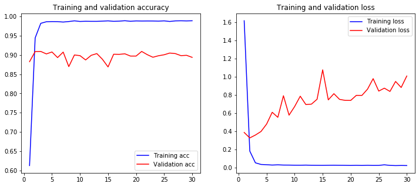
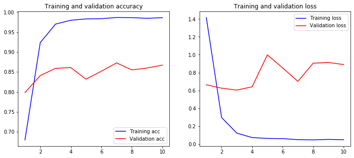
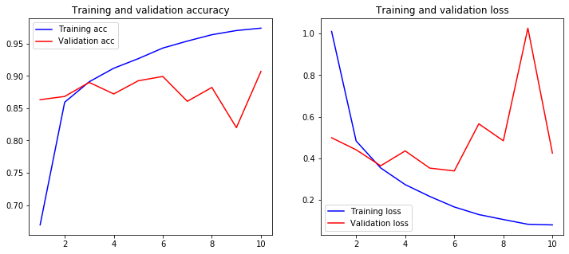

# Chinese Text Classification
## Zhixiang Wang

文本分类（Text Classification）是自然语言处理中的一个重要应用技术，根据文档的内容或主题，自动识别文档所属的预先定义的类别标签。<br>
本文语料来自搜狗新闻文本 [下载链接](https://pan.baidu.com/s/1SMfx0X0-b6F8L9J6T5Hg2Q)，密码:dh4x。<br>
预训练词向量模型来自[GitHub：Chinese Word Vectors 上百种预训练中文词向量](https://github.com/Embedding/Chinese-Word-Vectors)，下载地址：[Sogou News 300d](https://pan.baidu.com/s/1tUghuTno5yOvOx4LXA9-wg)。


<!-- TOC -->

* Chinese Text Classification
    * Part 1: 基于scikit-learn机器学习的文本分类方法
        * 1. 语料预处理
        * 2. 划分训练集与测试集
        * 3. TF-IDF文本特征提取
        * 4. 构建分类器
            * 朴素贝叶斯分类器
            * 逻辑回归LR
            * 支持向量机SVM
        * 5. 模型评估与比较
    * Part 2: 基于神经网络模型的文本分类方法
        * 1. 读取语料
        * 2. 语料预处理
            * 将文本转化为词向量矩阵
            * 划分训练集与校验集
        * 3. 构建模型
            * model 1 自己训练词权重向量
            * model 2 加载预训练模型权重
            * model 3 使用CNN进行文本分类
        * 4. 模型评估与比较

<!-- /TOC -->

## Part 1: 基于scikit-learn机器学习的文本分类方法

### 1. 语料预处理

搜狗新闻文本标签，`C000008`标签对应的新闻类别，为了便于理解，定义映射词典。

```python
category_labels = {
    'C000008': '_08_Finance',
    'C000010': '_10_IT',
    'C000013': '_13_Health',
    'C000014': '_14_Sports',
    'C000016': '_16_Travel',
    'C000020': '_20_Education',
    'C000022': '_22_Recruit',
    'C000023': '_23_Culture',
    'C000024': '_24_Military'
}
```

### 2. 划分训练集和测试集

将文本进行分词预处理，输出：训练语料数据(`X_train_data`)、训练语料标签(`y_train`)、测试语料数据(`X_test_data`)、测试语料标签(`y_test`)。

```python
X_train_data, y_train, X_test_data, y_test = load_datasets()
```
    label: _08_Finance, len: 1500
    label: _10_IT, len: 1500
    label: _13_Health, len: 1500
    label: _14_Sports, len: 1500
    label: _16_Travel, len: 1500
    label: _20_Education, len: 1500
    label: _22_Recruit, len: 1500
    label: _23_Culture, len: 1500
    label: _24_Military, len: 1500
    train corpus len: 13500

    label: _08_Finance, len: 490
    label: _10_IT, len: 490
    label: _13_Health, len: 490
    label: _14_Sports, len: 490
    label: _16_Travel, len: 490
    label: _20_Education, len: 490
    label: _22_Recruit, len: 490
    label: _23_Culture, len: 490
    label: _24_Military, len: 490
    test corpus len: 4410

### 3. TF-IDF文本特征提取

TF-IDF是一种统计方法，用以评估一字词对于一个文件集或者一个语料库中的其中一份文件的重要程度。字词的重要性随着它在文件中出现的次数成正比增加，但同时会随着它在语料库中出现的频率成反比下降。意味着一个词语在一篇文章中出现的次数越多，同时在所有文档中出现的次数越少，越能代表该文章。

```python
stopwords = open('dict/stop_words.txt', encoding='utf-8').read().split()

# TF-IDF feature extraction
tfidf_vectorizer = TfidfVectorizer(stop_words=stopwords)
X_train_tfidf = tfidf_vectorizer.fit_transform(X_train_data)
words = tfidf_vectorizer.get_feature_names()
```

### 4. 构建分类器

#### 朴素贝叶斯分类器

得到了训练样本的文本特征，现在可以训练出一个分类器，以用来对新的新闻文本进行分类。scikit-learn中提供了多种分类器，其中MultinomialNB比较适合于文本分类。

```python
mnb_clf = Pipeline([
    ('vect', TfidfVectorizer()),
    ('clf', MultinomialNB()),
])

%time mnb_clf.fit(X_train_data, y_train)
```

                   precision    recall  f1-score   support

      _08_Finance       0.88      0.90      0.89       477
           _10_IT       0.81      0.87      0.84       461
       _13_Health       0.82      0.90      0.86       451
       _14_Sports       0.98      1.00      0.99       480
       _16_Travel       0.89      0.91      0.90       480
    _20_Education       0.84      0.87      0.85       472
      _22_Recruit       0.90      0.73      0.80       606
      _23_Culture       0.80      0.83      0.82       476
     _24_Military       0.94      0.91      0.92       507

         accuracy                           0.87      4410
        macro avg       0.87      0.88      0.87      4410
     weighted avg       0.88      0.87      0.87      4410


#### 逻辑回归LR

尝试一下其他的分类器，比如`Logistic Regression`，训练新的分类器：

```python
lr_clf = Pipeline([
    ('vect', TfidfVectorizer()),
    ('clf', LogisticRegression()),
])

%time lr_clf.fit(X_train_data, y_train)
```
                   precision    recall  f1-score   support

      _08_Finance       0.86      0.94      0.90       451
           _10_IT       0.86      0.87      0.86       484
       _13_Health       0.91      0.90      0.90       496
       _14_Sports       0.98      0.99      0.99       485
       _16_Travel       0.91      0.92      0.91       484
    _20_Education       0.86      0.91      0.88       464
      _22_Recruit       0.88      0.87      0.88       495
      _23_Culture       0.87      0.77      0.82       552
     _24_Military       0.96      0.94      0.95       499

         accuracy                           0.90      4410
        macro avg       0.90      0.90      0.90      4410
     weighted avg       0.90      0.90      0.90      4410
     
#### 支持向量机SVM

在传统机器学习中，SVM是做文本分类最好的工具.

```python
svm_clf = Pipeline([
    ('vect', TfidfVectorizer()),
    ('clf', SGDClassifier(loss='hinge', penalty='l2')),
])

%time svm_clf.fit(X_train_data, y_train)
```
                     precision    recall  f1-score   support

        _08_Finance       0.87      0.95      0.91       449
             _10_IT       0.86      0.89      0.88       474
         _13_Health       0.92      0.91      0.92       495
         _14_Sports       1.00      0.99      0.99       493
         _16_Travel       0.94      0.92      0.93       501
      _20_Education       0.88      0.92      0.90       472
        _22_Recruit       0.93      0.89      0.91       515
        _23_Culture       0.89      0.85      0.87       512
       _24_Military       0.96      0.95      0.95       499

           accuracy                           0.92      4410
          macro avg       0.92      0.92      0.92      4410
       weighted avg       0.92      0.92      0.92      4410
       
### 5. 模型评估与比较

对新的文本需要进行分类.

```python
news_lastest = ["8月27日晚间，北京首钢篮球俱乐部官方宣布，正式与美籍华裔球员林书豪签约，林书豪将以外援身份，代表北京首钢队参加CBA联赛。同一时间，林书豪也在微博宣布：北京，我来了。过去9年时间里，华人林书豪在NBA经历了跌宕起伏的篮球生涯。从哈佛小子，到首位进入NBA的美籍华裔球员，再到千万身家的“林疯狂……与此同时，林书豪在国内获得了远高于在NBA的关注。",
                "在25日举行的七国工业国集团（G7）峰会上，美国总统特朗普在谈及朝鲜问题时重申近期朝鲜试射武器未违反协定，并指美韩军演是浪费金钱。据路透社报道，特朗普25日在与日本首相安倍晋三举行会谈时，谈及朝鲜问题。特朗普称他对朝鲜多次试射感到不满，但称发射“不违反任何协定”。",
                "8月14日，清华大学交叉信息院正式迎来了85名九字班新生。根据其官网的名单公示：今年5月18日校园开放日宣布成立的人工智能学堂班（简称智班）已完成了首次选拔，共录取30人。共有55名新生入学姚班。"]
X_new_data = [preprocess(doc) for doc in news_lastest]

mnb_clf.predict(X_new_data)
array(['_14_Sports', '_24_Military', '_20_Education'], dtype='<U13')
lr_clf.predict(X_new_data)
array(['_14_Sports', '_24_Military', '_20_Education'], dtype='<U13')
svm_clf.predict(X_new_data)
array(['_14_Sports', '_24_Military', '_14_Sports'], dtype='<U13')
```
比较各分类器的分类准确性

```
x_clf = ['mnb_clf', 'lr_clf', 'svm_clf']
y_clf = [mnb_score, lr_score, svm_score]
plt.bar(x_clf, y_clf)
plt.ylim(0.85, 0.92)
```


## Part 2: 基于神经网络模型的文本分类方法

### 1. 读取语料

### 2. 语料预处理

将文本转化为词向量矩阵
```
Shape of data tensor: (17910, 1000)
Shape of label tensor: (17910, 9)
```
data
```
array([[   0,    0,    0, ..., 1081, 2111,  218],
       [   0,    0,    0, ..., 3502,  508, 4917],
       [   0,    0,    0, ...,  193, 1287, 2759],
       ...,
       [   0,    0,    0, ...,  129,   31,  413],
       [   0,    0,    0, ...,  395, 3132,   46],
       [   0,    0,    0, ..., 4245, 1488,   23]], dtype=int32)
 ```
label

|序号|标签|名称|分类编码|
|:------:|:------:|:------:|:------:|
|0|C000008|Finance|[1, 0, 0, 0, 0, 0, 0, 0, 0]|
|1|C000010|IT|[0, 1, 0, 0, 0, 0, 0, 0, 0]|
|2|C000013|Health|[0, 0, 1, 0, 0, 0, 0, 0, 0]|
|3|C000014|Sports|[0, 0, 0, 1, 0, 0, 0, 0, 0]|
|4|C000016|Travel|[0, 0, 0, 0, 1, 0, 0, 0, 0]|
|5|C000020|Education|[0, 0, 0, 0, 0, 1, 0, 0, 0]|
|6|C000022|Recruit|[0, 0, 0, 0, 0, 0, 1, 0, 0]|
|7|C000023|Culture|[0, 0, 0, 0, 0, 0, 0, 1, 0]|
|8|C000024|Military|[0, 0, 0, 0, 0, 0, 0, 0, 1]|

### 3. 构建模型
#### 3.1. model 1 自己训练词权重向量

```python
model1 = Sequential()
model1.add(Embedding(input_dim=MAX_WORDS_NUM+1, 
                     output_dim=EMBEDDING_DIM, 
                     input_length=MAX_SEQUENCE_LEN))
model1.add(Flatten())
model1.add(Dense(64, activation='relu', input_shape=(input_dim,)))
model1.add(Dense(64, activation='relu'))
model1.add(Dense(len(labels_index), activation='softmax'))
_________________________________________________________________
Layer (type)                 Output Shape              Param #   
=================================================================
embedding_2 (Embedding)      (None, 1000, 300)         6000300   
_________________________________________________________________
flatten_2 (Flatten)          (None, 300000)            0         
_________________________________________________________________
dense_4 (Dense)              (None, 64)                19200064  
_________________________________________________________________
dense_5 (Dense)              (None, 64)                4160      
_________________________________________________________________
dense_6 (Dense)              (None, 9)                 585       
=================================================================
Total params: 25,205,109
Trainable params: 25,205,109
Non-trainable params: 0
_________________________________________________________________

Train on 14328 samples, validate on 3582 samples
Epoch 1/30
14328/14328 [==============================] - 74s 5ms/step - loss: 1.6176 - acc: 0.6128 - val_loss: 0.3883 - val_acc: 0.8825
Epoch 2/30
14328/14328 [==============================] - 77s 5ms/step - loss: 0.1836 - acc: 0.9441 - val_loss: 0.3285 - val_acc: 0.9087
Epoch 3/30
14328/14328 [==============================] - 77s 5ms/step - loss: 0.0546 - acc: 0.9819 - val_loss: 0.3600 - val_acc: 0.9090
........
Epoch 28/30
14328/14328 [==============================] - 73s 5ms/step - loss: 0.0242 - acc: 0.9886 - val_loss: 0.9496 - val_acc: 0.8981
Epoch 29/30
14328/14328 [==============================] - 73s 5ms/step - loss: 0.0254 - acc: 0.9882 - val_loss: 0.8832 - val_acc: 0.8989
Epoch 30/30
14328/14328 [==============================] - 73s 5ms/step - loss: 0.0246 - acc: 0.9886 - val_loss: 1.0093 - val_acc: 0.8936
```

#### 3.2. model 2 加载预训练模型权重
定义词嵌入矩阵
```
embedding_matrix = np.zeros((MAX_WORDS_NUM+1, EMBEDDING_DIM)) # row 0 for 0
for word, i in word_index.items():
    embedding_vector = embeddings_index.get(word)
    if i < MAX_WORDS_NUM:
        if embedding_vector is not None:
            # Words not found in embedding index will be all-zeros.
            embedding_matrix[i] = embedding_vector
```
加载预训练参数
```
model2 = Sequential()
model2.add(Embedding(input_dim=MAX_WORDS_NUM+1, 
                     output_dim=EMBEDDING_DIM, 
                     weights=[embedding_matrix],
                     input_length=MAX_SEQUENCE_LEN,
                     trainable=False))
model2.add(Flatten())
model2.add(Dense(64, activation='relu', input_shape=(input_dim,)))
model2.add(Dense(64, activation='relu'))
model2.add(Dense(len(labels_index), activation='softmax'))
_________________________________________________________________
Layer (type)                 Output Shape              Param #   
=================================================================
embedding_3 (Embedding)      (None, 1000, 300)         6000300   
_________________________________________________________________
flatten_3 (Flatten)          (None, 300000)            0         
_________________________________________________________________
dense_7 (Dense)              (None, 64)                19200064  
_________________________________________________________________
dense_8 (Dense)              (None, 64)                4160      
_________________________________________________________________
dense_9 (Dense)              (None, 9)                 585       
=================================================================
Total params: 25,205,109
Trainable params: 19,204,809
Non-trainable params: 6,000,300
_________________________________________________________________

Train on 14328 samples, validate on 3582 samples
Epoch 1/10
14328/14328 [==============================] - 36s 2ms/step - loss: 1.4167 - acc: 0.6799 - val_loss: 0.6633 - val_acc: 0.7984
Epoch 2/10
14328/14328 [==============================] - 38s 3ms/step - loss: 0.2968 - acc: 0.9234 - val_loss: 0.6250 - val_acc: 0.8409
Epoch 3/10
14328/14328 [==============================] - 36s 3ms/step - loss: 0.1220 - acc: 0.9698 - val_loss: 0.6039 - val_acc: 0.8590
Epoch 4/10
14328/14328 [==============================] - 36s 3ms/step - loss: 0.0720 - acc: 0.9795 - val_loss: 0.6405 - val_acc: 0.8610
Epoch 5/10
14328/14328 [==============================] - 36s 3ms/step - loss: 0.0625 - acc: 0.9828 - val_loss: 0.9981 - val_acc: 0.8319
Epoch 6/10
14328/14328 [==============================] - 36s 2ms/step - loss: 0.0603 - acc: 0.9833 - val_loss: 0.8529 - val_acc: 0.8518
Epoch 7/10
14328/14328 [==============================] - 40s 3ms/step - loss: 0.0486 - acc: 0.9863 - val_loss: 0.7012 - val_acc: 0.8727
Epoch 8/10
14328/14328 [==============================] - 41s 3ms/step - loss: 0.0460 - acc: 0.9860 - val_loss: 0.9048 - val_acc: 0.8551
Epoch 9/10
14328/14328 [==============================] - 37s 3ms/step - loss: 0.0517 - acc: 0.9844 - val_loss: 0.9132 - val_acc: 0.8599
Epoch 10/10
14328/14328 [==============================] - 39s 3ms/step - loss: 0.0477 - acc: 0.9858 - val_loss: 0.8896 - val_acc: 0.8671
```

#### 3.3. model 3 使用CNN进行文本分类
```
sequence_input = Input(shape=(MAX_SEQUENCE_LEN, ), dtype='int32')
embedded_sequences = embedding_layer(sequence_input)

x = Conv1D(128, 5, activation='relu')(embedded_sequences)
x = MaxPooling1D(5)(x)
x = Conv1D(128, 5, activation='relu')(x)
x = MaxPooling1D(5)(x)
x = Conv1D(128, 5, activation='relu')(x)
x = MaxPooling1D(35)(x)  # global max pooling
x = Flatten()(x)
x = Dense(128, activation='relu')(x)
preds = Dense(len(labels_index), activation='softmax')(x)
model3 = Model(sequence_input, preds)

_________________________________________________________________
Layer (type)                 Output Shape              Param #   
=================================================================
input_1 (InputLayer)         (None, 1000)              0         
_________________________________________________________________
embedding_4 (Embedding)      (None, 1000, 300)         6000300   
_________________________________________________________________
conv1d_4 (Conv1D)            (None, 996, 128)          192128    
_________________________________________________________________
max_pooling1d_4 (MaxPooling1 (None, 199, 128)          0         
_________________________________________________________________
conv1d_5 (Conv1D)            (None, 195, 128)          82048     
_________________________________________________________________
max_pooling1d_5 (MaxPooling1 (None, 39, 128)           0         
_________________________________________________________________
conv1d_6 (Conv1D)            (None, 35, 128)           82048     
_________________________________________________________________
max_pooling1d_6 (MaxPooling1 (None, 1, 128)            0         
_________________________________________________________________
flatten_5 (Flatten)          (None, 128)               0         
_________________________________________________________________
dense_11 (Dense)             (None, 128)               16512     
_________________________________________________________________
dense_12 (Dense)             (None, 9)                 1161      
=================================================================
Total params: 6,374,197
Trainable params: 373,897
Non-trainable params: 6,000,300
_________________________________________________________________

Train on 14328 samples, validate on 3582 samples
Epoch 1/10
14328/14328 [==============================] - 299s 21ms/step - loss: 1.0102 - acc: 0.6692 - val_loss: 0.4984 - val_acc: 0.8632
Epoch 2/10
14328/14328 [==============================] - 300s 21ms/step - loss: 0.4830 - acc: 0.8592 - val_loss: 0.4404 - val_acc: 0.8682
Epoch 3/10
14328/14328 [==============================] - 302s 21ms/step - loss: 0.3531 - acc: 0.8910 - val_loss: 0.3636 - val_acc: 0.8900
Epoch 4/10
14328/14328 [==============================] - 304s 21ms/step - loss: 0.2728 - acc: 0.9119 - val_loss: 0.4350 - val_acc: 0.8721
Epoch 5/10
14328/14328 [==============================] - 301s 21ms/step - loss: 0.2159 - acc: 0.9268 - val_loss: 0.3523 - val_acc: 0.8925
Epoch 6/10
14328/14328 [==============================] - 303s 21ms/step - loss: 0.1653 - acc: 0.9432 - val_loss: 0.3387 - val_acc: 0.8992
Epoch 7/10
14328/14328 [==============================] - 302s 21ms/step - loss: 0.1286 - acc: 0.9540 - val_loss: 0.5655 - val_acc: 0.8607
Epoch 8/10
14328/14328 [==============================] - 300s 21ms/step - loss: 0.1048 - acc: 0.9638 - val_loss: 0.4838 - val_acc: 0.8822
Epoch 9/10
14328/14328 [==============================] - 302s 21ms/step - loss: 0.0819 - acc: 0.9703 - val_loss: 1.0261 - val_acc: 0.8199
Epoch 10/10
14328/14328 [==============================] - 303s 21ms/step - loss: 0.0789 - acc: 0.9740 - val_loss: 0.4246 - val_acc: 0.9070
```

### 4. 模型评估与比较

将各模型训练的结果打印出来
* model 1<br>

* model 2<br>

* model 3<br>

